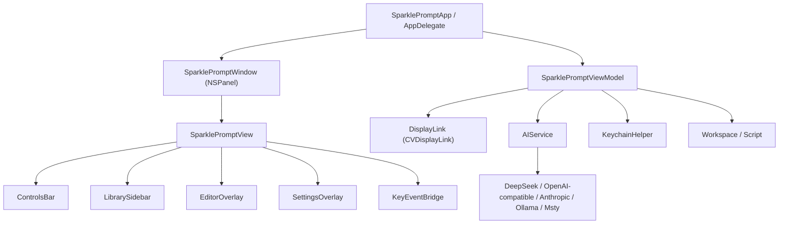
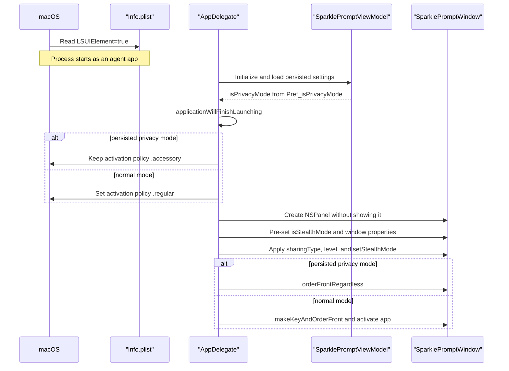

# SparklePrompt Implementation Notes

This document describes the implementation as it exists today. It is meant to
help maintainers navigate the code without having to reconstruct the app from
the SwiftUI view tree and the view model.

## Current Product Shape

SparklePrompt is a native macOS teleprompter with three main jobs:

1. Render a floating, transparent prompt window that can scroll smoothly.
2. Manage scripts as an in-app library grouped into workspaces.
3. Generate or transform prompt content through streaming AI providers.

The app is intentionally local-first. Imported user files are read and cached,
but normal library operations avoid mutating or deleting those source files. AI
outputs are written to an app-owned shadow directory under Application Support.

## Runtime Architecture



### App and Window

`Sources/SparklePrompt/SparklePromptApp.swift` owns the AppKit boundary:

- Creates the single transparent `NSPanel`.
- Sets window behavior: non-activating panel, full-size content view,
  movable-by-background, hidden titlebar controls, clear background, no shadow.
- Applies capture protection through `window.sharingType`.
- Applies privacy/stealth behavior through `NSApp.setActivationPolicy`.
- Release app bundles are generated with `LSUIElement = true`, so the process
  starts as an agent app before AppKit can show a Dock/menu-bar presence.
- Keeps a stable `baseWindowWidth` so opening and closing the script library
  expands the window without shrinking the main prompt area.

Startup is split by the persisted `Pref_isPrivacyMode` value loaded by
`SparklePromptViewModel` before any window is shown:

- Private startup keeps `.accessory`, applies `.none` capture protection and
  `.mainMenu` level first, then shows the panel with `orderFrontRegardless()`
  without activating the app or making the window key.
- Normal startup switches to `.regular`, applies normal capture/window level,
  then uses `makeKeyAndOrderFront` and `NSApp.activate`.

`swift run` does not use the generated bundle `Info.plist`, so it cannot verify
Dock zero-flash behavior. Use a `.app` from `build-app.sh` or
`package-release.sh` for that path.

`SparklePromptWindow` is the concrete `NSPanel` subclass. It can become key,
cannot become main, and suppresses the default Esc-to-close behavior.

### Startup Flow

The release build is designed so a user who last exited in privacy mode can
reopen the app without a Dock icon or normal foreground window flashing first.
This depends on both bundle metadata and AppKit ordering.



The important ordering is:

1. `build-app.sh` and `package-release.sh` write `LSUIElement = true` into the
   generated `Info.plist`. This makes the packaged app start as an agent app,
   before Swift code has a chance to run.
2. `AppDelegate.viewModel` is initialized before AppKit finishes launching.
   During that initial load, `SparklePromptViewModel.loadVisualSettings()`
   restores `Pref_isPrivacyMode`.
3. `applicationWillFinishLaunching` sets the activation policy from the loaded
   privacy value. Privacy mode keeps `.accessory`; normal mode upgrades to
   `.regular`.
4. `applicationDidFinishLaunching` creates and configures the panel while it is
   still hidden. It sets the titlebar, transparency, collection behavior,
   `sharingType`, window level, and `SparklePromptWindow.isStealthMode`.
5. `setHideFromCapture(startsPrivate)` and `setStealthMode(startsPrivate)` run
   before the first visible frame.
6. Privacy startup uses `orderFrontRegardless()` so the panel can appear
   without activating the app or becoming a normal key window. Normal startup
   uses `makeKeyAndOrderFront(nil)` followed by `NSApp.activate(...)`.

`KeyEventBridge.viewDidMoveToWindow()` is part of the startup contract. It may
make the bridge the first responder, but it must not unconditionally call
`makeKeyAndOrderFront`. It checks `SparklePromptWindow.isStealthMode`,
`viewModel.isPrivacyMode`, and `NSApp.isActive` before claiming key focus, so a
SwiftUI mount cannot accidentally activate a private startup window.

Privacy mode persistence intentionally bypasses the debounced save path at the
moment the mode changes. `isPrivacyMode.didSet` immediately writes
`Pref_isPrivacyMode`, then also schedules the normal save. Later
`UserDefaults.didChangeNotification` reloads must not overwrite
`isPrivacyMode`; `loadVisualSettings()` only restores that key during the
initial load. This prevents a privacy toggle from bouncing back because the
notification debounce is shorter than the save debounce.

Startup behavior cannot be fully verified with `swift run` or the raw
`.build/release/SparklePrompt` binary because those paths do not use the
generated `Info.plist`. Use a `.app` generated by `build-app.sh` or
`package-release.sh` when checking Dock/menu-bar flash behavior.

Startup maintenance rules:

- Keep `LSUIElement = true` in both app-bundle scripts whenever privacy startup
  must stay flash-free.
- Do not show, activate, or key the window before capture and stealth policies
  are applied.
- Do not add unconditional `NSApp.activate(...)` or `makeKeyAndOrderFront(...)`
  calls in view mounting code.
- If startup needs a system permission prompt, consider temporarily foregrounding
  a normal-mode path or presenting the prompt with an explicit recovery route;
  accessory apps can otherwise put system dialogs behind other windows.
- When changing this area, verify normal startup, persisted privacy startup,
  runtime privacy toggling, and Ghost Mode separately.

### View Model

`Sources/SparklePrompt/SparklePromptViewModel.swift` is the central state
object. It currently owns:

- Prompt text and rendered `AttributedString`.
- Playback state, scroll offset, content/viewport height, and timer state.
- Visual settings: speed, font size, line spacing, colors, opacity, mirror
  modes, code mode, and privacy blur.
- Privacy mode and Ghost Mode coordination.
- Script library state: workspaces, active workspace/script indices, search,
  import, refresh, move, rename, export, and remove.
- AI settings: provider, base URLs, models, roles, personal style, context
  switches, failover priority, streaming state, and error state.
- Persistence to `UserDefaults` and API-key persistence through Keychain.
- Debounced save and debounced search pipelines via Combine.

Because it is broad, changes should stay tightly scoped. Before moving logic
out of the view model, check whether the proposed split preserves the current
state ordering guarantees around save/load, active script switching, and AI
streaming.

### Views

`Sources/SparklePrompt/SparklePromptView.swift` contains the main UI:

- `SparklePromptView`: root overlay and right-hand library layout.
- `ScrollingText`: rendered prompt text with mirror/flip and scroll offset.
- `ReadingLine`: center reading marker.
- `AIPromptBar`: inline AI input and context tags.
- `AIStreamingBanner`: streaming state and cancel/follow controls.
- `ControlsBar`: responsive bottom controls, timer, library/privacy/settings
  buttons, sliders, and compact/full density variants.
- `LibrarySidebar`: workspace list, search, import/refresh controls.
- `ScriptRow`: row actions and context menu.
- `EditorOverlay`: inline text editor.

`Sources/SparklePrompt/SettingsView.swift` contains the settings overlay:

- Provider cards, model refresh, API key entry, and failover order.
- AI role editor.
- Context controls and personal style memory.
- Hotkey recorder.
- Appearance controls.
- Privacy and Ghost Mode controls.
- Advanced settings and reset.

## Script Library Model

The library model is in `Sources/SparklePrompt/Script.swift`.

`Workspace`:

- Has a name, scripts, expansion state, optional `folderURL`, and optional
  `folderBookmark`.
- Folder-backed workspaces can be refreshed from disk.
- Bookmarks help recover moved/renamed folders.

`Script`:

- Has an id, title, content, optional file URL, optional bookmark, last scroll
  offset, `isAIGenerated`, last modified date, and `isTitleCustomized`.
- Normal imported scripts use bookmarks to track source files.
- AI-generated scripts are treated as app-owned files.

### Import and Refresh Rules

Supported source file extensions are:

- `.txt`
- `.md`
- `.text`

Import behavior:

- A folder import creates a workspace named after the folder and recursively
  loads supported text files.
- A single file import adds the file to the active workspace.
- Drag-and-drop uses the same model as import.
- Clipboard paste creates a new script in the `收集箱` workspace.

Refresh behavior for folder-backed workspaces:

- Scans the backing folder for supported files.
- Matches existing scripts by path first, then bookmark resolution.
- Updates content when the disk modification date is newer.
- Adds new disk files.
- Removes non-AI entries that no longer exist in the folder scan.
- Keeps AI-generated scripts in the workspace because they live in the shadow
  directory, not the mounted source folder.

Remove/delete behavior:

- Removing a normal script only removes the library entry.
- Removing an AI-generated script also deletes its app-owned shadow file.
- Removing a workspace also removes that workspace's AI shadow directory.

## AI Flow

`Sources/SparklePrompt/AIService.swift` is an actor responsible for provider
requests. `SparklePromptViewModel.submitAIPrompt()` prepares the request and
owns the app-state side effects.

High-level flow:

1. User opens the AI bar and submits a prompt.
2. The view model builds a system prompt from personal style plus selected
   role.
3. Optional context is added from the current script or sorted current
   workspace scripts.
4. A new empty AI script is appended to the active workspace.
5. `AIService.stream(...)` sends a streaming request.
6. Each chunk updates the active text if the user is still viewing that script,
   and always updates the backing `workspaces` model.
7. On completion, the AI script is written to:
   `~/Library/Application Support/SparklePrompt/ai_scripts/<workspace-id>/`
8. The library is saved.

Provider behavior:

- DeepSeek, OpenAI-compatible, Msty Ollama, and Msty MLX use
  `/v1/chat/completions` by default.
- Native Ollama uses `/api/chat`.
- Anthropic official endpoints use `/v1/messages`; non-official Anthropic
  proxy URLs are sent to `/messages`.
- Model discovery reads `/models` for OpenAI-compatible/Anthropic-style
  providers and `/api/tags` for native Ollama.
- Network errors retry with a small backoff before failover.
- Failover tries configured providers in priority order when they have key,
  base URL, and model values.

Reasoning/thinking handling:

- DeepSeek `reasoning_content` and Anthropic thinking deltas are wrapped in
  `<think>...</think>`.
- Rendering hides the tags themselves.
- In normal mode, think-block text is shown as smaller gray italic text.
- In privacy mode, think-block text is hidden.

## Rendering and Scrolling

The scroll engine uses `CVDisplayLink` through
`Sources/SparklePrompt/DisplayLink.swift`. The display link callback reports a
hardware-timed frame timestamp, and the view model advances `scrollOffset` by:

```text
speed * deltaTime
```

This keeps scroll speed time-based rather than frame-count-based.

The rendered prompt is an `AttributedString` generated from `text`. Rendering
features:

- Markdown parsing where possible.
- Heading scaling.
- Strong-emphasis accent coloring.
- Code block detection with monospaced, left-aligned layout.
- Optional forced code mode.
- Think block styling/hiding.
- Per-line cache keyed by text, style, mode, and spacing to keep AI streaming
  responsive.

During AI streaming, text updates are throttled to render at most every 100 ms.
The app auto-follows new content by reacting after content height changes, so
scrolling follows the rendered output instead of the raw text event.

## Keyboard and Scroll Input

`Sources/SparklePrompt/KeyEventBridge.swift` installs local event monitors:

- Key monitor dispatches configurable shortcuts.
- Shortcut dispatch ignores key-repeat events and debounces identical key
  signatures to avoid duplicate toggles from rapid monitor churn.
- Scroll monitor adjusts `scrollOffset`.
- Esc closes active overlays or is swallowed to avoid closing the panel.
- Text input controls are allowed to receive normal unmodified key presses.
- Up/down arrows remain hard-coded speed controls outside the customizable
  shortcut map.

Default shortcuts live in `SparklePromptViewModel.resetShortcutsToDefault()`.
The user-customized shortcut map is encoded to `UserDefaults` under
`UserShortcuts_v2`.

## Persistence

`UserDefaults` stores:

- Visual settings: speed, font size, line spacing, opacity, colors, privacy
  mode, always-on-top.
- AI settings except secret key material: provider, base URLs, model lists,
  selected models, roles, context switches, failover, personal style, code mode.
- Library/workspace model under `UserWorkspaces_v1`.
- Shortcuts under `UserShortcuts_v2`.

`KeychainHelper` stores API keys using:

```text
service: com.sparkle.prompt.api-keys
account: APIKey_<provider raw value>
```

The save pipeline is debounced. Lightweight automatic saves update
`UserDefaults`; Keychain writes only happen on explicit settings save/close to
avoid repeated macOS authorization prompts.

Legacy migration notes:

- Old flat script libraries under `UserScriptLibrary_v1` migrate into
  `收集箱`.
- Old provider key dictionaries under `Pref_providerKeys` migrate into
  Keychain one key at a time.
- Old scripts/folders missing bookmarks are backfilled when the library loads.

## Privacy and Ghost Mode

Privacy mode is controlled by `SparklePromptViewModel.isPrivacyMode` and
applied by `AppDelegate`.

When privacy mode is on:

- `window.sharingType = .none`
- `NSApp.setActivationPolicy(.accessory)`
- window level is raised to `.mainMenu`
- always-on-top is forced
- presentation colors become low-contrast and optional blur is applied
- keyboard/UI exits require a second privacy toggle within the confirmation
  window, reducing accidental privacy-off events

Ghost Mode adds:

- 3-second preparation countdown.
- `mousePenetration = true`, applied only when settings/editor/AI panels are
  closed.
- privacy mode and always-on-top lock.
- forced playback.
- countdown display in the timer widget.
- automatic termination when the configured duration expires.

Manual privacy-off terminates Ghost Mode as a recovery path.

## Build and Release Scripts

`run.sh`:

- Builds release mode and launches `.build/release/SparklePrompt`.

`build-app.sh`:

- Builds release mode.
- Assembles a local `.app`.
- Generates the icon.
- Ad-hoc signs the bundle.
- Installs it to the Desktop.

`package-release.sh`:

- Builds a universal arm64 + x86_64 binary.
- Assembles `SparklePrompt.app`.
- Generates the icon.
- Ad-hoc signs it.
- Zips it as `sparkleprompt-v<version>-macos-universal.zip`.

`.github/workflows/release.yml`:

- Runs on `v*` tags or manual dispatch.
- Selects full Xcode.
- Runs `package-release.sh`.
- Uploads the zip artifact.
- Publishes a GitHub release for tags.

## Known Maintenance Risks

- The view model is large and mixes UI state, persistence, library operations,
  AI orchestration, and playback. Add tests or careful manual checks around
  active index handling when changing it.
- Some control-bar buttons mutate published properties directly instead of
  using guarded toggle methods, so privacy/Ghost Mode guard logic is not
  uniformly enforced through the UI path.
- There is no automated test suite in the repository today.
- Provider streaming formats are handled with loose JSON dictionaries; schema
  changes from providers can fail silently or surface as generic network/API
  errors.

## Practical Change Checklist

When changing user-facing behavior:

- Update `README.md` shortcut and feature sections.
- Update `SparklePromptViewModel.defaultText` if the in-app quick guide changes.
- Update `CHANGELOG.md` for visible behavior changes.
- Check whether settings need a migration key or default backfill.
- Verify normal mode, privacy mode, and Ghost Mode if the change touches window
  behavior, controls, or input handling.
- Verify normal imported scripts and AI-generated scripts separately if the
  change touches library operations.
