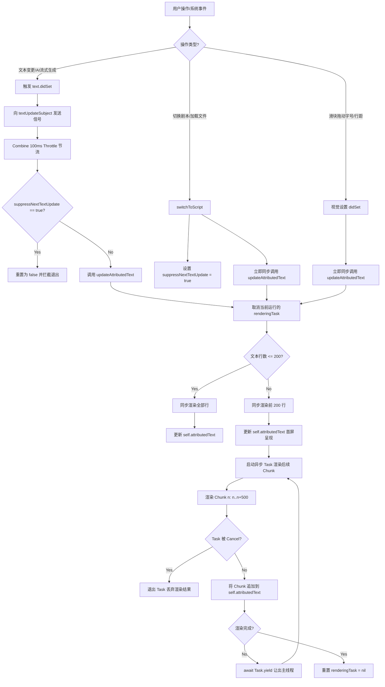

# SparklePrompt 文本渲染架构与工作流设计

本指南详述了 SparklePrompt 在处理长剧本时的文本渲染管线设计，阐明了如何通过**平铺级缓存**、**首屏同步+后台渐进式异步渲染**以及 **Combine 防抖与节流**解决 AppKit/SwiftUI 主线程卡顿问题的架构细节。旨在为后续的调试和二次开发提供技术指引。

---

## 1. 架构总览 (Architecture Overview)

在 macOS 提词器场景下，渲染包含 10,000+ 行 Markdown（及思考块 `<think>`、代码块 \`\`\` 等）的富文本存在严重的性能瓶颈。主要瓶颈源自以下两点：
1. **Markdown 语法解析开销**：`AttributedString(markdown:)` 是一个高开销操作，大段文本同步解析会导致明显的 UI 冻结。
2. **Swift 桥接开销**：频繁地在 Swift `AttributedString` 与 Objective-C `NSMutableAttributedString` 之间桥接以应用段落样式（行间距、对齐等）非常耗时。

### 核心优化策略
* **视觉样式解耦缓存 (Flat lineCache)**：`lineCache` 仅缓存由原始行文本解析得到的*无样式* `AttributedString`。任何视觉属性（字号、颜色、行距）的调整**均不会清空此缓存**，只在渲染时动态应用样式。
* **渐进式渲染 (Progressive Rendering)**：对于大文档，采取“首屏同步渲染（200 行，耗时 <2ms）+ 后台分批渐进异步渲染（500 行/批）”的策略。结合协程挂起 (`Task.yield()`)，确保 UI 以 60 FPS 响应用户交互。
* **单次桥接段落样式**：每一分块（Chunk）在纯 Swift 状态下处理完 runs 的字号与颜色后，仅在最终应用段落样式时进行 **1 次** `NSMutableAttributedString` 桥接，消除了 $O(N)$ 的桥接开销。

---

## 2. 渲染核心组件 (Core Components)

### 2.1 缓存设计 (`lineCache`)
```swift
private var lineCache: [String: AttributedString] = [:]
```
* **Key**：单行的原始文本 `String`（包含空格与标点）。
* **Value**：**无任何自定义视觉样式**的、仅带有 Markdown 基础格式（如加粗、斜体等 runs 属性）的 `AttributedString`。
* **容量保护**：超过 `25,000` 条记录时自动清空，防止内存溢出。

### 2.2 核心渲染方法

#### `renderLines(_:range:isInsideThinkBlock:isInsideCodeBlock:) -> AttributedString`
* **功能**：渲染指定行范围的文本。
* **逻辑**：
  1. 遍历指定范围的行索引。
  2. 进行 `<think>` 和 `\`\`\`` 的块判定，通过 `inout` 变量传递块状态。
  3. 若缓存中没有该行，则通过 `AttributedString(markdown:)` 解析并存入 `lineCache`。
  4. 获取缓存的 `AttributedString` 副本，根据当前激活的模式（隐私模式、代码模式）及设置项（字号、前景色、高亮色）动态对其 `runs` 修改字体与颜色。
  5. 记录这一行的 UTF-16 长度及它的样式类型（`think`、`code`、`normal`）。
  6. 将拼装好的分块转换为 `NSMutableAttributedString`，遍历记录的行范围，批量应用段落样式（`lineSpacing`, `alignment`, `headIndent`）。
  7. 转换回 `AttributedString` 并返回。

#### `updateAttributedText()`
* **功能**：调度渲染流程，处理同步与异步渲染任务的分发。
* **逻辑**：
  1. 检查并取消之前的 `renderingTask`，防止多重协程并发竞态。
  2. 若文档总行数 `<= 200`，立即同步调用 `renderLines` 完成渲染。
  3. 若文档总行数 `> 200`，同步渲染前 `200` 行并赋值给 `attributedText`（瞬间呈现首屏）；然后启动 `@MainActor Task`，以 `500` 行为一个分块，在后台逐步调用 `renderLines` 渲染，并通过 `attributedText.append()` 追加文本，在分块间执行 `await Task.yield()` 释放主线程控制权。

---

## 3. 工作流生命周期与事件响应 (Workflow & Lifecycle)

下面的流程图展示了当用户操作（如更改文本、切换剧本、更改设置）时，渲染系统的执行逻辑：



---

## 4. 典型场景调试与开发指南 (Debugging & Development Guide)

### 4.1 样式未正确应用
* **原因排查**：检查 `renderLines` 中 runs 遍历的属性赋值。请注意，因为 SwiftUI 和 AppKit 类型的命名冲突，在修改 `AttributedString` 属性时**必须显式**作用于 `.swiftUI` 命名空间（如 `lineAttr.swiftUI.font` 或 `lineAttr.swiftUI.foregroundColor`），并且对基础类型使用明确的作用域（如 `Font.system`）。
* **检查点**：
  ```swift
  // 正确写法
  lineAttr[run.range].swiftUI.font = Font.system(size: runSize, weight: weight, design: Font.Design.default)
  ```

### 4.2 渐进式渲染任务未被及时取消（导致文字乱序追加）
* **原因排查**：在 `updateAttributedText()` 每次启动前，必须有 `renderingTask?.cancel()`。同时，在异步 Task 的 `while` 循环内部，每次调用 `renderLines` 前后，**必须立即**判断 `Task.isCancelled` 并 `break`。
* **检查点**：
  ```swift
  while currentIndex < lines.count {
      if Task.isCancelled { break }
      let chunkAttr = self.renderLines(...)
      if Task.isCancelled { break } // 必须在 append 前再次确认
      self.attributedText.append(chunkAttr)
      ...
  }
  ```

### 4.3 滑动调节滑块时依然卡顿
* **原因排查**：确认是否不小心在字号（`fontSize`）或行距（`lineSpacing`）等 didSet 中引入了 `lineCache.removeAll()`。`lineCache` 应该在调整视觉样式时保持持久化，仅在解析缓存条数突破上限（`25,000`）时清空。

### 4.4 切换剧本时画面闪烁
* **原因排查**：切换剧本时需要立刻更新首屏，因此我们在 `switchToScript` 中跳过 Throttle 防抖直接同步调用了一次 `updateAttributedText()`。如果发现再次闪烁，请检查是否在 `textUpdateSubject.sink` 节流方法中漏掉了 `suppressNextTextUpdate` 标志位的拦截，导致 100ms 后又触发了多余的渲染。
